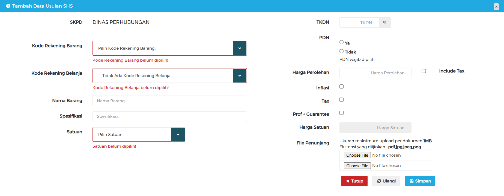

# Panduan Pengajuan SSH

Dalam Peraturan Pemerintah Nomor 12 Tahun 2019 tentang Pengelolaan Keuangan Daerah Pasal 97 ayat (1) disebutkan bahwa Penyusunan RKA SKPD dengan menggunakan pendekatan penganggaran berdasarkan kinerja yang berpedoman pada indikator kinerja, tolok ukur dan sasaran kinerja sesuai analisis standar belanja, standar harga satuan, rencana kebutuhan BMD dan Stand Pelayanan Minimal. Standar harga satuan merupakan harga satuan barang dan jasa yang ditetapkan dengan keputusan Kepala Daerah dengan mempertimbangkan standar harga satuan regional. Penetapan biaya standar dimaksudkan sebagai upaya preventif menekankan penyalahgunaan anggaran. Salah satu Rencana Aksi Pemberantasan Korupsi (KPK) mengamanatkan kepada Aparat Pengawas Intern Pemerintah (APIP) untuk melakukan reviu sebagaimana diatur dalam Peraturan Menteri Dalam Negeri Nomor 11 Tahun 2019 tentang Reviu atas Dokumen Perencanaan Pembangunan dan Anggaran Daerah Tahunan.

## Pengertian 4 (Empat) Jenis Standar Biaya

1. SSH adalah harga satuan setiap unit barang/jasa yang berlaku disuatu daerah.

2. HSPK adalah harga komponen kegiatan fisik/non fisik melalui analisis yang distandarkan untuk setiap jenis komponen kegiatan dengan menggunakan SSH sebagai elemen penyusunannya.

3. SBU adalah harga satuan setiap unit non barang/jasa seperti honorarium dan perjalanan dinas yang berlaku di suatu daerah.

4. ASB adalah penilaian kewajaran atas beban kerja dan biaya yang digunakan untuk melaksanakan suatu kegiatan.

## Panduan Aplikasi Standar Harga (Reksaharga)

Aplikasi Standar Harga Satuan Barang sebagai dasar penyusunan perencanaan dan penganggaran yang ditetapkan dengan Peraturan Bupati Pasuruan. Panduan ini dapat diunduh di [Manual Book Reksa Harga](http://reksaharga.pasuruankab.go.id/bahan_pelatihan.pdf).

Berikut tampilan usulan SHS dalam aplikasi Reksa Harga :

Untuk pengisian pada *form* tersebut, dapat diisi dengan acuan sebagai berikut :
1. Kode Rekening Barang

    Kode rekening barang dapat disesuaikan dengan jenis barang/jasa atau dapat diunduh [disini](../assets/ssh/data-rekening-aset.xlsx).

2. Kode Rekening Belanja

    Kode rekening belanja dapat disesuaikan dengan jenis barang/jasa.

3. Nama Barang

    Dimasukan nama barang/jasa.

4. Spesifikasi

    Dimasukan spesifikasi barang/jasa.

5. Satuan

    Pilih satuan barangnya menyesuaikan jenis barang/jasa.

6. TKDN

    Input nilai TKDN dari barang yang diajukan. Nilai TKDN dapat diperoleh dari :

    a. [Daftar Inventarisasi Barang/Jasa TKDN Kemenperin](https://tkdn.kemenperin.go.id/).

    b. Surat Pernyataan dari Penyedia Barang.

7. PDN

    Pilih apakah barang/jasa tersebut merupakan **Produk Dalam Negeri**.

8. Harga Perolehan

    Centang tanda *include tax* jika harga barang/jasa sudah termasuk pajak.

9. Inflasi

    Centang tanda *inflasi* jika harga barang/jasa akan ditambahkan nilai inflasi.
    > Contoh : Belanja printer yang diinput pada Tahun 2023, akan dilaksanakan pada Tahun Anggaran 2024 dimana terdapat inflasi sehingga harga printer tersebut lebih tinggi daripada yang diinput. Dalam kondisi ini, maka inflasi perlu dicentang.

10. Tax

    *Tax* akan otomatis tercentang jika *include tax* dicentang. Sedangkan jika harga barang/jasa tersebut belum termasuk pajak dan dicentang *tax* nya, maka harga satuan akan bertambah.

11. Prof+Guarantee

    Dicentang apabila terdapat tambahan biaya untuk garansi.

12. Harga Satuan

    Harga satuan akan otomatis terisi sesuai isian *form* sebelumnya.

13. File Penunjang

    Foto dari barang/jasa yang menampilkan harga pembanding dari harga satuan yang diusulkan.
    Harga pembanding tersebut dapat diperoleh dari :

    a. [E-Katalog LKPP](https://e-katalog.lkpp.go.id/). Pilih **Lokal**, kemudian pilih **Kabupaten Pasuruan**.

    b. [MBiz Market](https://www.mbizmarket.co.id/).

    c. Toko *Online* (Tokopedia, Shopee, Bhinneka, dan sebagainya).

    d. Penyedia barang/jasa.